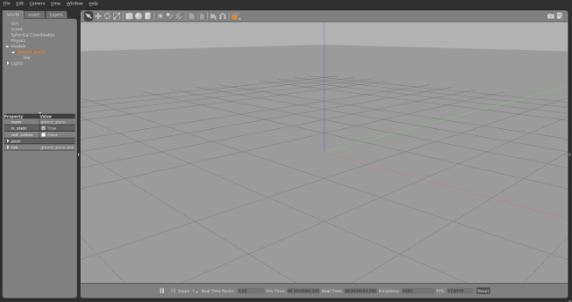
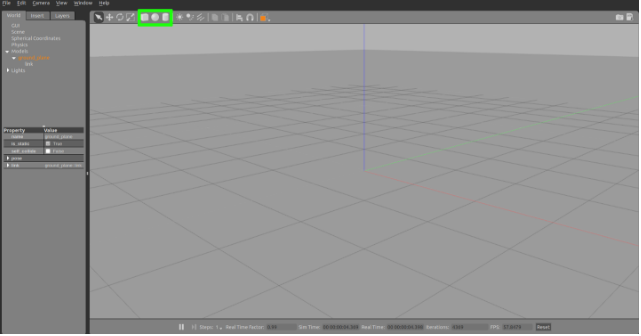
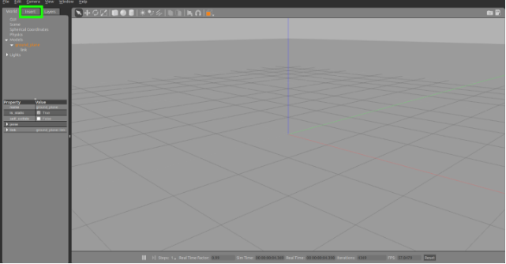
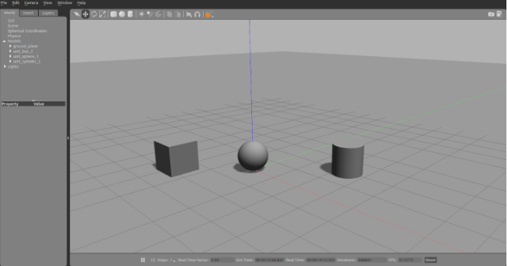
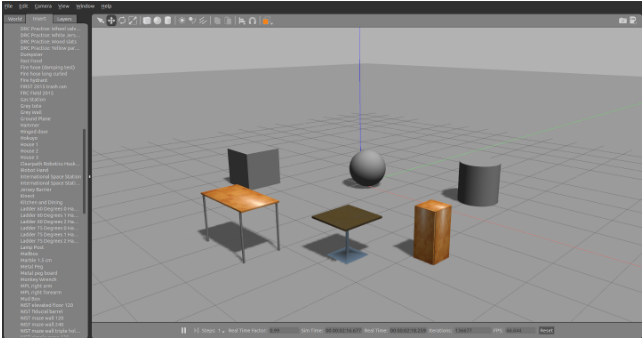
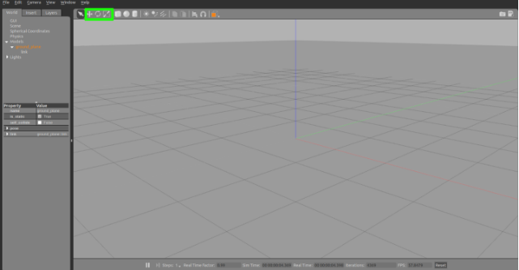

== Terminoloji

* World:Bu terim, robotlar ve nesneler (binalar, tablolar ve ışıklar gibi) ve gökyüzü, ortam ışığı ve fizik özellikleri de dahil olmak üzere genel parametreleri tanımlamak için kullanılır.
* Static:Statik olarak işaretlenmiş varlıklar (SDF'de <static> true </ statik> öğesine sahip olanlar) yalnızca çarpışma geometrisine sahip nesnelerdir. Taşınması amaçlanmayan tüm nesneler statik olarak işaretlenmelidir, bu da bir performans artışıdır.
*Dynamic:Dinamik olarak işaretlenen varlıklar (<statik> öğeyi yoksayar veya SDF'de yanlış ayarlar), atalet ve çarpışma geometrisine sahip nesnelerdir.

== Kuruluş

* Gazebonun kurulu olduğundan emin olun.
* Gazeboyu çalıştırın, sadece bir yer düzlemi olan bir dünya görmelisiniz.

== Nesneleri Ekleme

* Gazebo, Gazebo'ya nesneler eklemek için iki mekanizma sunmaktadır.
* Birincisi, oluşturma penceresinin üzerinde bulunan basit şekiller kümesidir.

* İkinci model veritabanı, sol üst köşedeki Ekle sekmesini seçerek erişilebilir.

== Basit Şekiller Ekleme

Kutular, küreler ve silindirler, oluşturma penceresinin üzerindeki uygun simgeye tıklayarak dünyaya eklenebilir. Her şekil birim büyüklüğündedir:

* Kutu:1*1*1 metre
* Küre:1 metre çap
* Silindir:1 metre çap,1 metre yükseklik
* Kutu simgesini seçin ve sonra farenizi oluşturma penceresinin üzerine getirin. Farenizle hareket eden bir kutu görürsünüz. Kutunun bulunduğu konumdan memnun olduğunuzda sol tıklayın.
*Küre ve silindir için de aynı prosedürü tekrarlayın. Buna benzer bir dünya ile bitmelisiniz:

== Model veritabanından model ekleme
* Gazebo'nun model veritabanı, robotlar, tablolar ve bina da dahil olmak üzere her türlü modelin deposudur.
* 1.Model veritabanına erişmek için sol üst köşedeki Ekle sekmesini seçin.
* Model listesi mevcut konumlarına göre bölümlere ayrılmıştır. Her bölüm bir yol veya URI ile etiketlenmiştir. Uzak bir sunucuda bulunan bir nesneyi seçmek, modelin ~ / .gazebo / modellerde indirilmesini ve depolanmasına neden olacaktır.
* 2.Dünyaya çeşitli modeller eklemeyi deneyin. Bazıları büyük olabileceğinden, modelleri indirirken sabırlı olun.
* 3.Eklemeye karar verdiğiniz modellere bağlı olarak, aşağıdakine benzer bir şey yapmanız gerekir:

== Pozisyon Modelleri

* Her modelin pozu çevirme ve döndürme araçları ile değiştirilebilir

== Çeviri
* Çeviri aracı, nesneyi x, y ve z eksenleri boyunca hareket ettirmenize olanak tanır. Bu aracı şimdi seçin (veya t tuşuna basın) taşımak istediğiniz nesneyi tıklayın. Nesnenin üzerinde x, y ve z yönlerinde hareket etmenize izin veren üç eksenli bir görsel işaretleyici nesne üzerinde görünecektir.
* Ayrıca nesnenin üzerine tıklayıp x-y düzleminde ilerlemek için sürükleyebilirsiniz. Nesneyi sürüklerken x, y veya z tuşlarına basıp tutarak nesnenin hangi eksene ilerleyeceğini kontrol edebilirsiniz.
* Hareketi 1 metre ızgaraya kenetlemek için Ctrl tuşunu basılı tutabilirsiniz.
* Nesne dünyayla hizalanmıyorsa (bir sonraki açıklama döndürme aracını kullandıktan sonra), Shift tuşunu basılı tutarak görsel işaretleyiciler dünyaya göre hizalanır ve dünya koordinatlarına tercüme edilebilir.

Nesneleri şimdi farklı bir yapılandırmaya hareket ettirmeyi deneyin.

== Döndürme

* Döndürme aracı, bir modeli x, y ve z eksenleri etrafında yönlendirmenize olanak tanır. Bu aracı şimdi seçin (veya r tuşuna basın) taşımak istediğiniz nesneyi tıklayın. Nesnenin üzerinde x, y ve z eksenlerinin etrafında döndürülebilmenizi sağlayan üç halkalı şekilli görsel işaretleyici nesne üzerinde görünecektir.

* Hareketi bu eksenlerden birine kısıtlamak için sürüklerken nesnenin kendisini tıklamanız ve x, y veya z tuşlarını basılı tutmanız da mümkündür.
 *Hareketi 45 derece basamaklı hale getirmek için Ctrl tuşunu basılı tutabilirsiniz.
* Nesne dünyayla hizalanmıyorsa, Shift tuşunu basılı tutarak görsel işaretleyiciler dünyayla hizalı görünebilir ve dünya eksenleri etrafında döndürebilirsiniz.
* Nesneleri farklı bir yapılandırmaya çevirmeyi deneyin.

== Ölçek

* Ölçek aracı, bir modeli x, y ve z yönlerinde yeniden boyutlandırmanıza izin verir. Şu anda ölçek aracı sadece basit şekillerle, örneğin kutu, silindir ve küre ile çalışmaktadır. Bu aracı şimdi seçin (veya s tuşuna basın) basit bir şekle tıklayın. Nesnenin üzerinde üç eksenli bir görsel işaretleyici görüntülenir; böylece nesnenin x, y ve z boyutlarını ölçeklendirebilirsiniz.
* Ölçeklemeyi bu eksenlerden biriyle sınırlandırmak için sürüklerken yalnızca nesnenin üzerine tıklayabilir ve x, y veya z tuşlarını basılı tutabilirsiniz.
* 1 metrelik artışlarla ölçeklemek için Ctrl tuşunu basılı tutabilirsiniz.
* Basit şekilleri farklı boyutlara ölçeklendirmeyi deneyin.

== Modelleri Sil

* Modeller de seçilerek ve Sil tuşuna basılarak veya bir modeli sağ tıklatıp Sil'i seçerek silinebilir.
* Birkaç model silmeyi deneyin.

== Saving a World

* Worldden memnun olduğunuzda dosya menüsünden tasarruf edebilirsiniz.
* Şimdi Dosya menüsünü seçin ve Farklı Kaydet'i seçin.
* Yeni bir dosya adı girmenizi isteyen bir pop-up görünür. My_world.sdf dosyasını girin ve tamam'ı tıklayın.

== Loading a World

* Kaydedilen bir dünya komut satırına yüklenebilir:
* Gazebo my_world.sdf
* Dosya adı geçerli çalışma dizininde olmalıdır veya tam yolu belirtmelisiniz.

=Genel Bakış
=Building Editor'ü aç
* Gazebo'nun kurulu olduğundan emin olun.
*Bekleme başlatın ..

[[source,linux5]]
----
gazebo
----
Edit menüsünde, Building Editor'a gidin veya editörü açmak için Ctrl + B tuşlarına basın.

resim

==Grafiksel kullanıcı arayüzü
* Editör, aşağıdaki 3 alandan oluşmaktadır:
* Binanız için özellikler ve malzemeler seçebileceğiniz Palet.
* İzi almak (isteğe bağlı) ve duvar, pencere, kapı ve merdiven eklemek için bir kat planı içe aktarabileceğiniz 2D Görünümü.
* Binanızın önizlemesini görebileceğiniz 3D Görünüm. Ayrıca, binanızın farklı bölümlerine renkler ve dokular atayabilirsiniz.
resim

==Kat planı içe aktar
* Sıfırdan bir sahne oluşturabilir veya mevcut bir görüntüyü izlemek için bir şablon olarak kullanabilirsiniz. Bu görüntü, örneğin bir binanın 2D lazer taraması olabilir.
* Örnek bir kat planı almak için burayı tıklayın, ardından aşağıdaki şekilde ilerleyin:
* İçe Aktar düğmesini tıklayın. İçe Aktar iletişim kutusu çıkar.
* 
1. Adım: Daha önce bilgisayarınıza kaydettiğiniz resmi seçin ve ilerleyin
resim

* Adım 2: Görüntünün üzerinde izlediğiniz duvarların doğru ölçekte çıktığından emin olmak için görüntünün çözünürlüğünü metre başına piksel (px / m) olarak ayarlamanız gerekir. Çözünürlüğü bilseydik, doğrudan iletişim kutusuna yazabilir ve Tamam'ı tıklatabiliriz. Bu örnekte çözünürlüğü bilmiyoruz, fakat görüntüdeki iki nokta arasındaki gerçek dünya mesafesini biliyoruz (örneğin, üst duvar 7.5 m), bu yüzden çözünürlüğü hesaplamak için kullanabiliriz:
* Duvarın bir ucundaki tıklama / bırakma. Fareyi hareket ettirirken, aşağıda gösterildiği gibi turuncu bir çizgi görünür.
* Satırı tamamlamak için duvarın sonunda tıkla / bırak.
* Şimdi diyalogda metreyi metre cinsinden yazınız (bu durumda 7.5 m). Çözünürlük, çektiğiniz satıra göre otomatik olarak hesaplanacaktır.
*Daha sonra Tamam'ı tıklayabilirsiniz.
resim

* Görüntü, 2D Görünümünde düzgün ölçeklendirilmiş olarak görünür.
* İpucu: Daha fazla düzey ekledikten sonra, her biri için aynı işlemi yineleyerek bir kat planı içe aktarabilirsiniz.
== Özellikler ekleyin
== Duvar ekle
* Kat planında yer alan tüm duvarları aşağıdaki gibi takip edin. Duvarları daha sonra pencere ve kapıları bağlayacağımızı unutmayın; burada duvarların üzerlerine çizebilirsiniz. Duvarlar mükemmel değilse çok fazla endişelenme, onları daha sonra düzenleyeceğiz.
* Palette Duvar üzerine tıklayın.
* 2D Görünüm'de, duvarı başlatmak için herhangi bir yere tıklayın / serbest bırakın. Fareyi hareket ettirirken, duvarın uzunluğu görüntülenir.
* Mevcut duvarı sonlandırmak ve bitişik bir duvarı başlatmak için tekrar tıklayın.
* Yeni bir duvar başlatmadan bir duvar bitirmek için çift tıklayın.
* İpucu: Geçerli duvar segmentini çizmeyi iptal etmek için sağ tıklatabilir veya Esc tuşuna basabilirsiniz.
* İpucu: Varsayılan olarak, duvarlar 15 ° ve 0,25 m'lik artışlarla ve mevcut duvarların bitiş noktalarına yapışır. Bunu geçersiz kılmak için çizim sırasında Shift tuşunu basılı tutun.

resim

==Pencere ve kapı ekle
* Not: Şu anda, pencereler ve kapılar duvardaki basit deliklerdir.
* Kat planında gösterilen yerlere pencere ve kapı ekleyelim.

* Palette Pencere veya Kapı'yı tıklayın.

* Fareyi 2B görünümünde hareket ettirirken, eklenecek özellik de, 3 Boyutlu Görünüm'deki eşdeğeri ile birlikte hareket eder.

* İpucu: Üzerindeyken pencere ve kapı otomatik olarak duvarlara çırpar. Duvarın uçlarına olan mesafeler hareket ettikçe görüntülenir.
* Özelliği yerleştirmek için istediğiniz konumu tıklayın.
resim

* İpucu: Duvarların üstüne çizildikten sonra özelliklerin yer planınıza nerede olduğunu görmek zor olabilir. Kolaylaştırmak için, 2D Görünümün üst kısmında, geçerli seviyeye ilişkin kat planını veya özelliklerini görüntülemeyi veya gizlemeyi seçebilirsiniz. Ayrıca, görünürlük arasında geçiş yapmak için kısayol tuşlarını, kat planı için F'yi ve özellikler için G tuşunu kullanabilirsiniz.

resim

==Merdiven ekle
* Bu kat planında merdivenler yok, ancak her neyse biz ekleyeceğiz.
* Palette Merdivenleri tıklayın.

* Fareyi 2B görünümünde hareket ettirirken, eklenecek merdiven, 3B Görünüm'deki eşdeğeri ile birlikte hareket eder.

* Merdiveniniz için bir yer seçin ve tıklayarak yerleştirin.

resim

==Seviyeler ekle

* Seviye 1 ile hemen hemen işimiz bitti. Binamıza bir başka kat daha ekleyelim ki merdivenlerimiz bir yerlerde bitiyor.

* Düzey eklemek için 2B Görünümün üst kısmında + işaretini tıklayın. Alternatif olarak, 2D Görünümü sağ tıklayın ve Bir seviye ekle'yi seçin.

* Yeni bir kat eklendiğinde, bir zemin otomatik olarak eklenir. Aşağıdaki seviyede merdivenler varsa, bina kaydedildiğinde merdivenlerin üstündeki bir delik yerden kesilecek.

* Not: Şu anda, tüm katlar dikdörtgen şeklindedir.

* İpucu: Bir düzey eklemeden önce, üstüne inşa etmek için geçerli seviyede duvarlar bulunduğundan emin olun.

* İpucu: Şu anda, aşağıdaki seviyeden gelen tüm duvarlar varsayılan malzemelerle yeni seviyeye kopyalanır. Başka hiçbir özellik kopyalanmaz. İstemediğiniz duvarları manuel olarak silebilirsiniz

resim

==Binanızı Düzenleyin
* Not: Binanızı düzenlerken dikkatli olun; Editörün şu anda işlemlerinizi geri almanız için herhangi bir seçeneği yoktur.

* İpucu: Tüm ölçümler metre cinsindendir.

==Seviyeleri değiştir

* Bir seviye ekledikten sonra 2D görünümünde yeni seviyeye getirildi. 2D Görünümün üst kısmındaki açılır listeden seçerek Düzey 1'e geri dönebilirsiniz.

* İpucu: 2D Görünüm'de seçili olan seviye, 3D Görünümde yarı şeffaf görünür ve altındaki tüm düzeyler opak görünür. Yukarıdaki düzeyler gizlenecek - ancak halen binanızın bir parçası olduklarını unutmayın!
* İstersek bazı düzey yapılandırmalarını da düzenleyebiliriz.

* Düzey yapılandırma seçenekleriyle bir denetçi açmak için 2D Görünümü çift tıklatın. Alternatif olarak, sağ tıklayın ve Seviyeyi    Denetleyiciyi Aç'ı seçin.
* İstediğiniz seviyeleri eklemiş olabilirsiniz veya geçerli seviyede belki de karışıklık yaratmış ve baştan başlatmak istediğiniz düzeyler olabilir.

resim

resim

== Duvarları düzenleme
* Daha önce bir sürü duvar çizdik, fakat belki istediklerimizi tam olarak ortaya çıkarmamışlardı.

* 2D Görünüm'de, düzenlenecek duvarı tıklayın.

* A. Duvarı yeni bir konuma sürükleyerek çevirin.

* B. Son noktalarından birini sürükleyerek duvarı yeniden boyutlandırın veya döndürün.

* İpucu: Varsayılan olarak, duvarlar 15 ° ve 0.25 m'lik artışlarla kapanır. Bunu geçersiz kılmak için çizim sırasında Shift tuşunu basılı tutun.
* Yapılandırma seçenekleriyle bir denetçi açmak için 2D Görünüm'de bir duvara çift tıklayın. Alternatif olarak sağ tıklayın ve Duvar Denetçisini Aç'ı seçin. Değişiklikleri önizlemek için bazı alanları düzenleyin ve Uygula tuşuna basın.

* Bir duvar silmek için Seçili haldeyken Sil tuşuna basın veya 2D Görünüm'deki duvara sağ tıklayın ve Sil'i seçin.

* İpucu: Bir duvarın düzenlenmesi, ekli duvarları hesaba katar.

* İpucu: Bir duvarın silinmesi, ona bağlı tüm kapıları ve pencereleri siler.
Geçerli seviyeyi silmek için 2D Görünümün üst kısmındaki - düğmesine basın veya sağ tıklayın ve Seviyeyi Sil'i seçin.

resim 

resim

== Pencere ve kapıları düzenle
* Şimdi pencereler ve kapılarla oyalım. Duvarlar için yaptığımız gibi pencereleri ve kapıları daha net bir şekilde birkaç farklı şekilde işleyebiliriz.

* 2D Görünüm'de, düzenlenecek özelliğe tıklayın.

* A. Özelliği yeni bir konuma sürükleyerek çevirin. Unutmayın ki pencereler ve kapılar otomatik olarak duvarlara yapışıyor ve bir duvardaki delikleri temsil ettikleri için onları herhangi bir duvardan ayırmak pek mantıklı değil.

* B. Özelliğini döndürme tutamacını sürükleyerek döndürün. Şu anda, bir duvara yapıştırıldıkça, yönelimleri bir fark yaratmaz.

* C. Bitiş noktalarından birini sürükleyerek özellik genişliğini yeniden boyutlandırın.

* Yapılandırma seçenekleriyle bir denetçi açmak için 2D Görünümdeki bir özelliği çift tıklatın. Alternatif olarak, sağ tıklayın ve Pencere / Kapı Denetçisini Aç'ı seçin.

* Bir özelliği silmek için, seçili haldeyken Delete tuşuna basın veya 2B Görünüm'de sağa tıklayın ve Delete'i seçin.

resim

==Merdivenleri düzenleme
* Son olarak, daha önce taktığımız merdivenleri düzenleyelim. Kat planında olmadığı için yaratıcı olabiliyor ve istediğiniz gibi yeniden boyutlandırabiliyoruz.

* 2D Görünümde, merdiveni seçmek için tıklayın.

* A. Merdivenleri yeni bir konuma sürükleyerek çevirin.

* B. Merdiveni dönme kolunu sürükleyerek 90 ° katlar halinde döndürün.

* C. Son düğümlerden birini sürükleyerek merdiveni yeniden boyutlandırın.

* Yapılandırma seçenekleriyle bir denetçi açmak için 2D Görünümdeki merdiveni çift tıklatın. Alternatif olarak, sağ tıklayın ve Merdivenleri Aç Inspector'i seçin.

* Merdivenleri silmek için Seçili haldeyken Sil tuşuna basın veya sağ tıklayın ve Sil'i seçin.

* İpucu: 2D Görünümde, merdivenler hem başlangıç hem de bitiş seviyelerinde görülebilir.

resim

==Renk ve doku ekle
* Artık her şey düzgün yerleştirilmiş ve boyutlandırılmış olduğundan, duvarlara, zemine ve merdivenlere renk ve doku atayabilirsiniz. Unutmayın ki pencereler ve kapılar sadece duvardaki deliklerdir ve bu nedenle malzemeler olamaz.

* İpucu: Varsayılan renk beyaz, varsayılan doku yoktur.
* Binanıza renk ve doku eklemek için iki yol vardır:

 Müfettişlerden
* Sırasıyla Duvar İnceleyicisi, Merdiven Müfettişleri ve Seviye Müfettişlerinden duvarlara, merdivenlere ve zemine renk ve doku ekleyebilirsiniz. Müfettişinizi açmanız, malzemelerinizi seçmeniz ve Uygula tuşuna basmanız yeterlidir.

resim

==Paletten
* Renkler ve dokular Paletten seçilebilir ve binanızdaki öğelere 3D Görünümde tıklayarak atanabilir.

* Paletteki bir renk veya dokuyu tıklayın.

* Farenizi 3D Görünümde hareket ettirirken, seçilen malzemenin önizlemesini gösteren fareyle gezinen özellikler vurgulanır.

* Vurgulanmış özelliğe tıklamak, seçilen materyali ona atar. İstediğiniz kadar çok özelliğe tıklayabilirsiniz.

* Seçili malzeme ile işiniz bittiğinde, 3B görünümünü sağ tıklatın veya herhangi bir özelliğin dışına tıklayarak malzeme modundan çıkın.

resim 

resim

* İpucu: Her özellik yalnızca bir renk ve tek bir dokuya sahip olabilir. Özelliğin tüm yüzlerine aynı malzeme atanır.

* Not: Şu anda Bina Editörü'nde özel dokular atamak mümkün değildir.

==SAVİNG YOUR BUİLDİNG
* Tasarruf, binanız için bir dizin, SDF ve yapılandırma dosyaları oluşturacaktır.

* Kaydetmeden önce binanıza Palette bir isim verin.

resim

* Üst menüde, Dosya'yı seçin ve Farklı Kaydet'i seçin (veya Ctrl + S tuşlarına basın). Modelinizin bulunduğu yeri seçebileceğiniz bir iletişim kutusu gelecektir.

* İpucu: Gelişmiş Seçenekler altında binanız için bazı meta veri ayarlayabilirsiniz.

resim

== Çıkış
* Not: Yapı Editöründen çıktığınızda, binanız artık düzenlenemez.

* Binanızı oluşturmayı tamamladığınızda ve kaydettiğinizde, Dosya'ya gidin ve Bina Editöründen Çık'a gidin.

* Binanız ana pencerede görünecektir. Gelecekte binayı Ekle sekmenizde bulabilirsiniz.

resim

